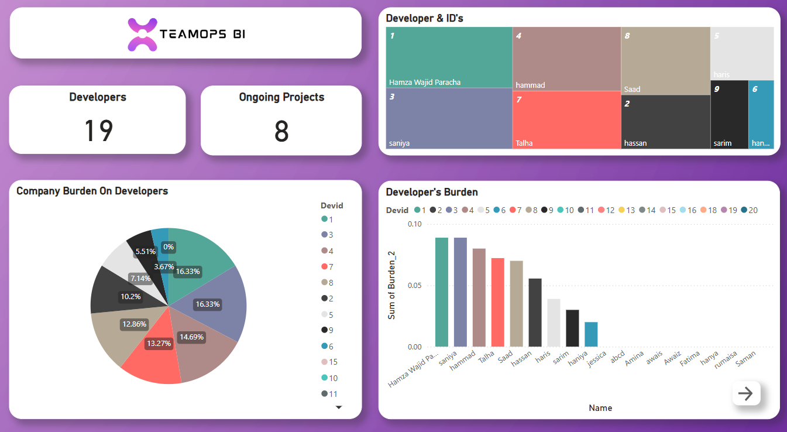
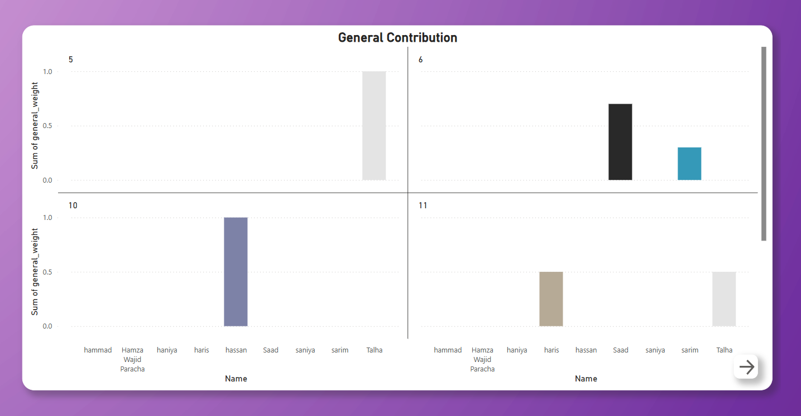
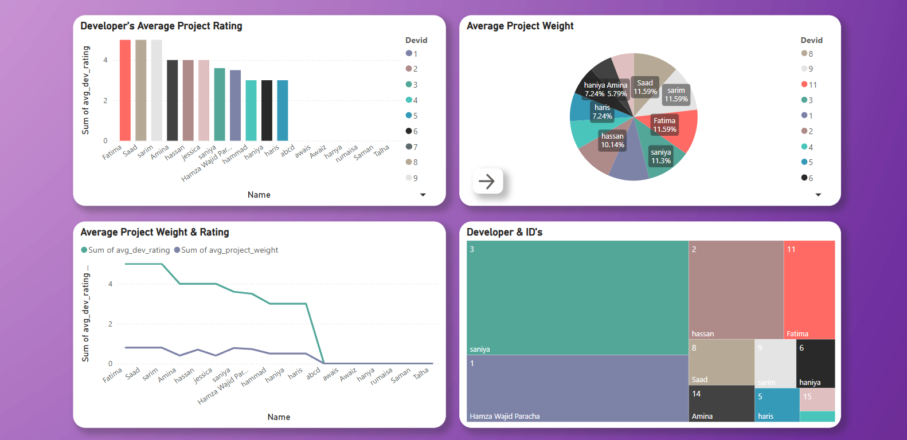
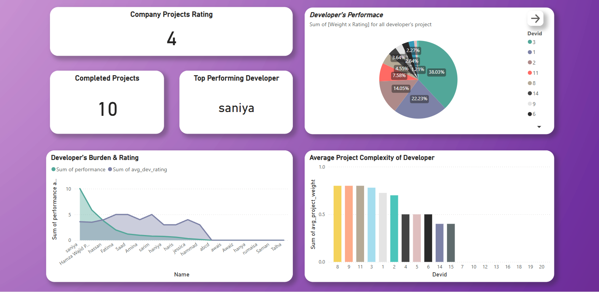

# TeamOps-BI

TeamOps-BI is an input-driven web app for entering and updating team and project data into a MySQL database, which then feeds a polished, interactive dashboard in the Power BI service. The dashboard provides scheduled refreshes, role-based access, and real-time insights into developer workload, project ratings, and performance trends.

## Features
- Input-driven web application for team and project management
- MySQL database backend
- Power BI dashboard with real-time analytics
- Scheduled data refresh and role-based access
- Visual insights into developer efficiency and project performance

## Dashboard Preview
A preview video of the dashboard is available in the [`dashboard/Dashboard.mp4`](dashboard/Dashboard.mp4) file.

## Live Dashboard Website
Access the live Power BI dashboard here:

👉[View the dashboard in Power BI](https://app.powerbi.com/reportEmbed?reportId=a28a0237-5ea5-4826-adf9-e8f08f55cc25)

## Quick Start
1. Clone this repository.
2. Set up the MySQL database using the scripts in the `database/` folder.
3. Run the web app in the `code/` directory (see relevant `.py` or `.ipynb` files).
4. View the dashboard using the provided website or directly in Power BI.

## Dashboard Website
The dashboard website is a simple page that embeds the Power BI dashboard for easy access. You can find it at [`dashboard/index.html`](dashboard/index.html).

## Project Images
Below are the images used in this project:

## Repository Structure
- `code/` – Source code and notebooks
- `dashboard/` – Dashboard preview video and website
- `database/` – Database scripts and sample data
- `images/` – Project images and logos

## License
This project is licensed under the MIT License. See the [LICENSE](LICENSE) file for details.
